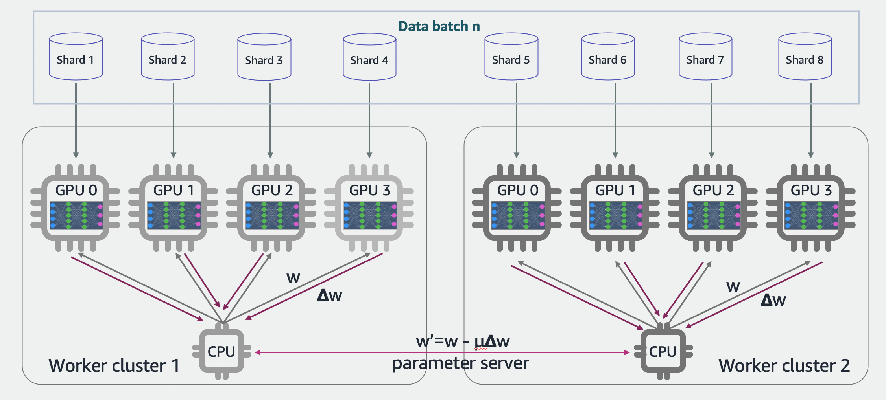
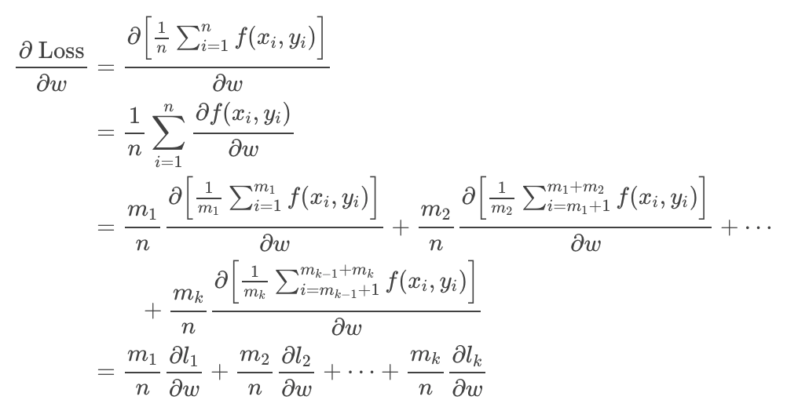
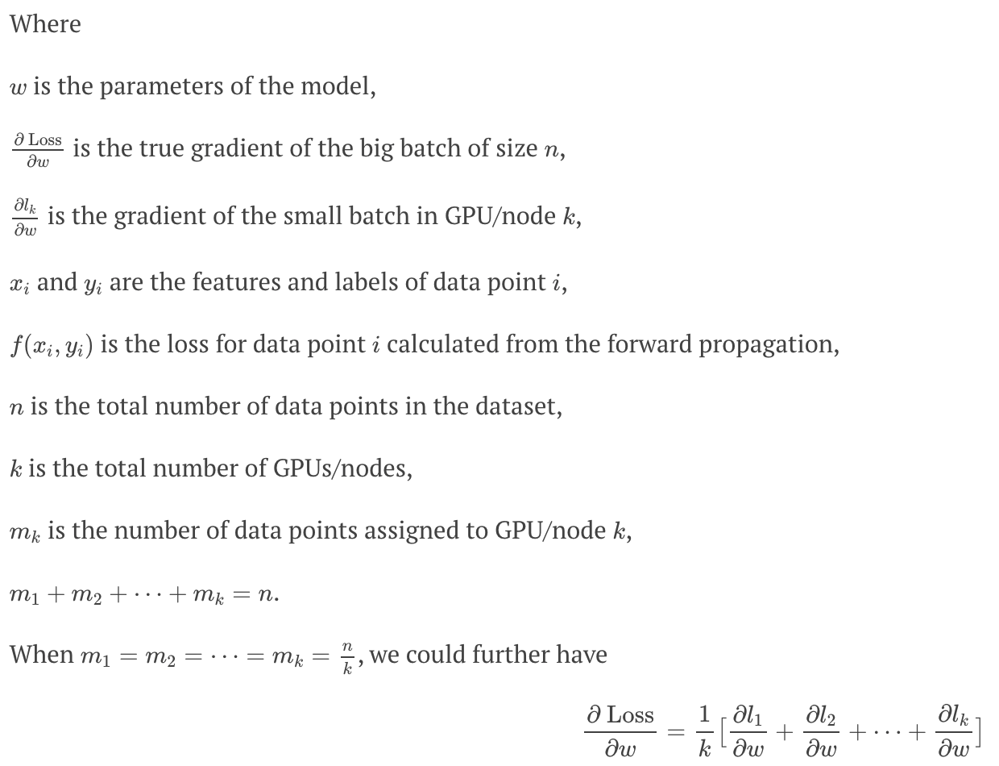

<<<<<<< HEAD
# Distributed Training with SageMaker
## Introduction

SageMaker offers distributed training libraries smdistributed to support data and model parallelism. The libraries are optimized for the SageMaker training environment, help adapt your distributed training jobs to SageMaker, and improve training speed and throughput.

Machine Learning (ML) practitioners commonly face two scaling challenges when training models: scaling model size and scaling training data. While model size and complexity can result in better accuracy, there is a limit to the model size you can fit into a single CPU or GPU. Furthermore, scaling model size may result in more computations and longer training times.

### Data Parallelism

The SageMaker distributed data parallel library extends SageMaker training capabilities on deep learning models with near-linear scaling efficiency, achieving fast time-to-train with minimal code changes.

When training a model on a large amount of data, machine learning practitioners often turn to distributed training to reduce the time to train. In some cases, where time is of the essence, the business requirement is to finish training as quickly as possible or at least within a constrained time period. Then, distributed training is scaled to use a cluster of multiple nodes—not just multiple GPUs in a computing instance, but multiple instances with multiple GPUs. As the cluster size increases, so does the significant drop in performance. This drop in performance is primarily caused by the communications overhead between nodes in a cluster.

To resolve such overhead problems, SageMaker offers two distributed training options: SageMaker model parallel and SageMaker data parallel. This guide focuses on how to train models using the SageMaker data parallel library.

* The library optimizes your training job for AWS network infrastructure and Amazon EC2 instance topology.

* The library takes advantage of gradient updates to communicate between nodes with a custom AllReduce algorithm.





SageMaker's distributed data parallel library addresses communications overhead in two ways:

* The library performs AllReduce, a key operation during distributed training that is responsible for a large portion of communication overhead.

* The library performs optimized node-to-node communication by fully utilizing AWS’s network infrastructure and Amazon EC2 instance topology.





Use this data parallel library to increase speed by up to 25% in training models such as BERT. While implementations like Horovod offer sub-linear performance at scale, this library offers near-linear performance at scale. This means that you get a faster training time and a lower cost to train a model.


### Model Parallelism

Model parallelism is the process of splitting a model up between multiple devices or nodes (such as GPU-equipped instances) and creating an efficient pipeline to train the model across these devices to maximize GPU utilization. ncreasing deep learning model size (layers and parameters) can result in better accuracy. However, there is a limit to the maximum model size you can fit in a single GPU. When training deep learning models, GPU memory limitations can be a bottleneck in the following ways:

* They can limit the size of the model you train. Given that larger models tend to achieve higher accuracy, this directly translates to trained model accuracy.

* They can limit the batch size you train with, leading to lower GPU utilization and slower training.

To overcome the limitations associated with training a model on a single GPU, you can use model parallelism to distribute and train your model on multiple computing devices.

Amazon SageMaker's model parallel library makes model parallelism more accessible by providing automated model splitting and sophisticated pipeline execution scheduling. The model splitting algorithms can optimize for speed or memory consumption. The library also supports manual partitioning. When you use the library, training is executed in a pipelined fashion over microbatches to maximize GPU usage. When you use SageMaker's model parallel library, you can take advantage of automated model splitting, also referred to as automated model partitioning. The library uses a partitioning algorithm that balances memory, minimizes communication between devices, and optimizes performance. You can configure the automated partitioning algorithm to optimize for speed or memory.

Alternatively, you can use manual model splitting. We recommend automated model splitting, unless you are very familiar with the model architecture and have a good idea of how to efficiently partition your model.


The following image is an example of a TensorFlow graph partitioned by the model parallel library, using automated model splitting. When a graph is split, each resulting subgraph is replicated B times (except for the variables), where B is the number of microbatches. In this figure, each subgraph is replicated 2 times (B=2). An SMPInput operation is inserted at each input of a subgraph, and an SMPOutput operation is inserted at each output. These operations communicate with the library backend to transfer tensors to and from each other.


### Use Cases

Data parallel is the most common approach to distributed training: You have a lot of data, batch it up, and send blocks of data to multiple CPUs or GPUs (nodes) to be processed by the neural network or ML algorithm, then combine the results. The neural network is the same on each node. A model parallel approach is used with large models that won’t fit in a node’s memory in one piece; it breaks up the model and places different parts on different nodes. In this situation, you need to send your batches of data out to each node so that the data is processed on all parts of the model.

If you are training with a large dataset, start with a data parallel approach. You can also try the following to improve performance with data parallel:

Change your model’s hyperparameters.
Reduce the batch size.
Keep reducing the batch size until it fits. If you reduce batch size to 1, and still run out of memory, then you should try model-parallel training.
Try gradient compression (FP16, INT8).
Try reducing the input size.
Combine with hyperparameter optimizations (HPO)
If you run out of memory during training, you may want to switch to a model parallel approach, or try hybrid model and data parallelism. Start with model-parallel training when:

Your model does not fit on a single device.
Due to your model size, you’re facing limitations in choosing larger batch sizes, such as if your model weights take up most of your GPU memory and you are forced to choose a smaller, suboptimal batch size.
SageMaker smdistributed linraries support distributed training with pipeline, tensor and combined parallelism.

```
smp_options_combined = {
    "enabled":True,
    "parameters": {
        "microbatches": 4,
        "placement_strategy": "cluster", # or spread or cluster 
        "pipeline": "interleaved",
        "pipeline_parallel_degree": 2,
        "tensor_parallel_degree": 2,
        "optimize": "speed",
        "partitions": 4,
        "ddp": True,
    }
}

```

The smdistributed libraries can work with hyperparameter optimization, including SageMaker supported random and Bayesian search strategies. We are actively working on integrating smdistributed libraries with training compiler, another training acceleration mechanism developed for SageMaker.


## Demo Contents

1. Distributed training of Hugging Face pretrained model for QnA with data parallelism
    
    
2. Distributed training of Hugginfg Face pretrained model for text classification with model parallelism

